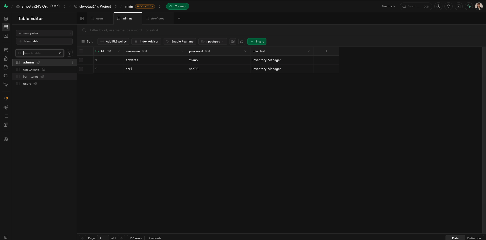
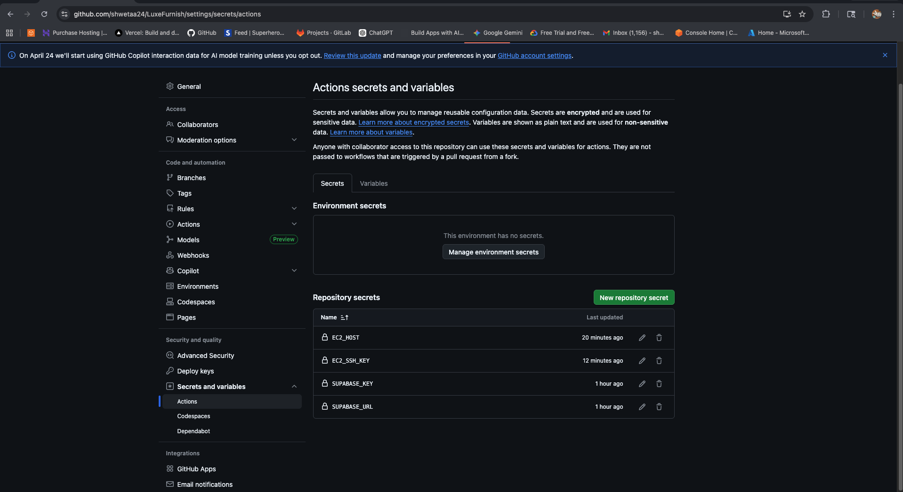
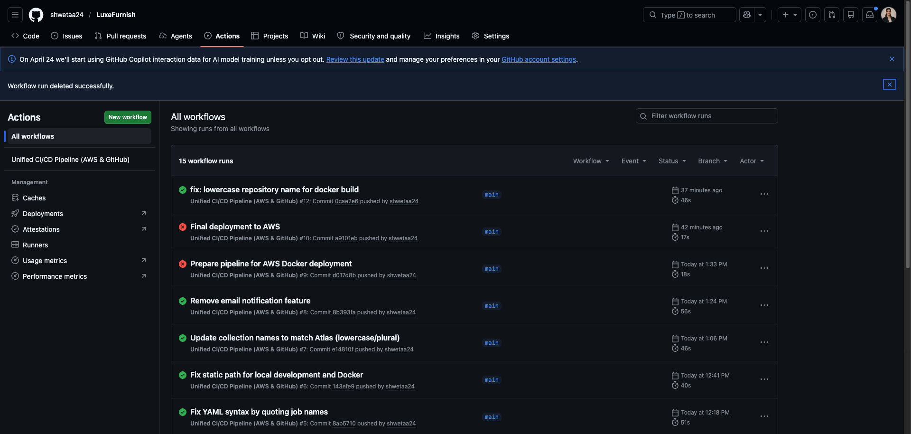
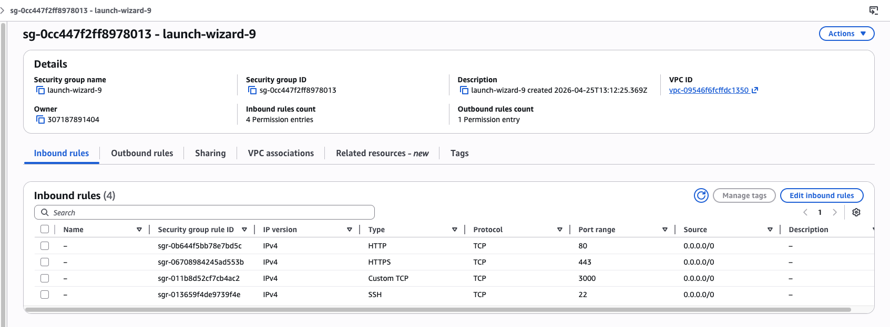
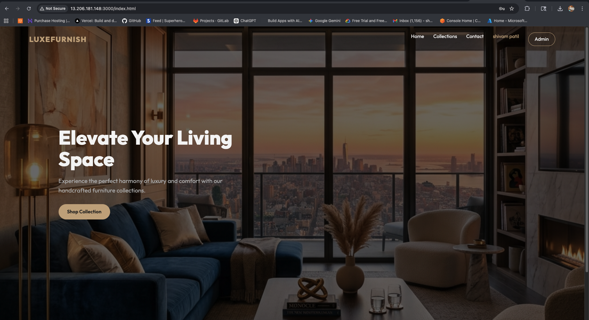

# LuxeFurnish - Professional Furniture Management System

LuxeFurnish is a modern, full-stack web application designed for furniture store owners to manage their inventory and customer inquiries efficiently. It features a sleek, premium design with a robust backend powered by Node.js and Supabase.

## 🚀 Project Overview

This assignment focuses on building a scalable furniture store portal with secure administrative access, real-time inventory tracking, and a streamlined customer contact flow. The project is fully containerized and includes a professional CI/CD pipeline for automated deployments.

---

## 🛠️ Technology Stack

| Layer | Technologies Used |
| :--- | :--- |
| **Frontend** | HTML5, CSS3 (Vanilla), JavaScript (ES6+) |
| **Backend** | Node.js, Express.js |
| **Database** | Supabase (PostgreSQL) |
| **DevOps** | Docker, Docker Compose, GitHub Action

---

## ✨ Key Features

- **Admin Dashboard**: Secure login for store administrators to manage stock and view customer leads.
- **Inventory Management**: Real-time tracking of furniture items with categorized storage in Supabase.
- **Customer Portal**: Dedicated interface for customers to view collections and submit inquiries.
- **Data Isolation**: Robust multi-user logic ensuring admins only see their own data.
- **CI/CD Pipeline**: Automated testing and deployment workflows via GitHub Actions.
- **Containerized Environment**: One-command setup using Docker Compose.

---

## 📝 Assignment Completion Steps

To successfully complete this project, the following steps were executed:

### 1. Project Initialization & Architecture
- Structured the workspace into dedicated `frontend` and `backend` directories.
- Initialized a Node.js project and installed necessary dependencies (Express, Supabase-js, etc.).

### 2. Backend Development
- Built a RESTful API using **Express.js**.
- Integrated **Supabase** as the primary database for high-performance data handling.
- Implemented secure authentication logic and data-fetching routes for admin and customer interactions.

### 3. Frontend Implementation
- Designed a "premium feel" UI using **Vanilla CSS**, focusing on modern typography and responsive layouts.
- Developed interactive pages: `index.html` (Landing), `admin.html` (Dashboard), `collections.html`, and `login.html`.
- Connected frontend forms to backend APIs using the Fetch API.

### 4. Containerization (Docker)
- Created a `Dockerfile` for the backend to ensure environment consistency.
- Created a `Dockerfile` for the frontend (using Nginx or a simple static server).
- Orchestrated the multi-container setup with `docker-compose.yml`.

### 5. CI/CD & Deployment
- Configured **GitHub Actions** (`.github/workflows/main.yml`) to automate the build and deployment process.
- Deployed the application to **AWS EC2** for the backend and **S3/CloudFront** for the frontend assets.

---

## ⚙️ How to Run Locally

1. **Clone the repository**:
   ```bash
   git clone <repository-url>
   cd LuxeFurnish
   ```

2. **Set up Environment Variables**:
   Create a `.env` file in the `backend` folder:
   ```env
   SUPABASE_URL=your_supabase_url
   SUPABASE_KEY=your_supabase_anon_key
   PORT=3000
   ```

3. **Run with Docker**:
   ```bash
   docker-compose up --build
   ```
   The app will be available at `http://localhost:3000`.

4. **Run without Docker**:
   - Backend: `cd backend && npm install && npm start`
   - Frontend: Open `frontend/index.html` in a browser or use a live server.

---

## 📸 Screenshots

### 1. Supabase Database Configuration


### 2. GitHub Actions CI/CD Pipeline



### 3. AWS Deployment (EC2 & Security Groups)



---

## 🔧 Tools Used

- **Supabase**: For database management and authentication.
- **Docker**: For containerizing the application.
- **GitHub Actions**: For continuous integration and deployment.
- **AWS**: For cloud hosting.
- **Postman**: For API testing and validation.
